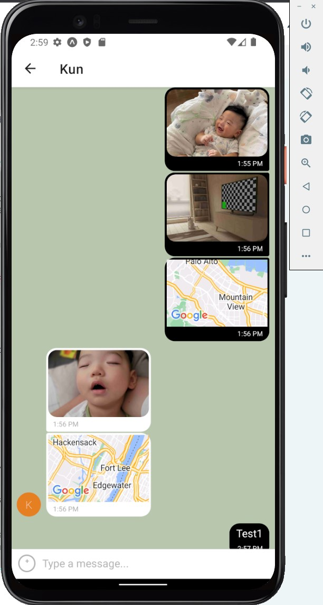

# Chat App

## Objective:

To build a chat app for mobile devices using React Native.
The app will provide users with a chat interface and options to share images and their location.

### Key features:

- A page where users can enter their name and choose a background color for the chat screen before joining the chat.
- A page displaying the conversation, as well as an input field and submit button.
- The chat must provide users with two additional communication features: sending images and location data.
- Data gets stored online and offline.

### User stories:

- As a new user, I want to be able to easily enter a chat room so I can quickly start talking to my friends and family.
- As a user, I want to be able to send messages to my friends and family members to exchange the latest news.
- As a user, I want to send images to my friends to show them what I’m currently doing.
- As a user, I want to share my location with my friends to show them where I am.
- As a user, I want to be able to read my messages offline so I can reread conversations at any time.
- As a user with a visual impairment, I want to use a chat app that is compatible with a screen reader so that I can engage with a chat interface.

### Technologies Used 

- React Native - front end Javascript library
- Gifted Chat - an open-source React Native library
- Expo - native app development platform
- Android Studio - mobile development environemnt with Emulator
- Google Firebase - non-relational database for storing messages. 
- Google Firestore - storage solution for media based chat messages. 

### Prerequisites
```markdown
Firebase account (https://firebase.google.com/).
expo go account (https://expo.dev/).
Follow expo CLI's instructions.
Install the Expo Go app on your phone (for testing purposes)
```
# Step-by-Step guide on how to clone and set up project:
## Getting Started
Follow instructions to get a copy of the project up and running on your local machine for development and testing purposes.  
  
1. Clone the repo
   ```
   git clone https://github.com/KunKang82/chat_app.git
   ```
2. Install NPM packages
   ```
   npm install
   ```
3. Install Expo CLI
   ```
   npm install -g expo-cli
   ```
4. Create a new Firebase project in your [Firebase console](https://console.firebase.google.com/). 

5. In the Firebase console, navigate to "Project settings" and then to the "General" tab. Here, you'll find your Firebase project's configuration object in the "Your apps" section. It'll look something like this:

   ```javascript
   const firebaseConfig = {
     apiKey: "AIzaSy...",
     authDomain: "my-app.firebaseapp.com",
     databaseURL: "https://my-app.firebaseio.com",
     projectId: "my-app",
     storageBucket: "my-app.appspot.com",
     messagingSenderId: "123456789",
     appId: "1:1234:web:ee873bd1234b2a1f4ee234",
     measurementId: "G-12345"
   };
   ```
   
6. Copy this configuration object to your clipboard.

7. In your project, navigate to the `Chat.js` file and replace the existing `firebaseConfig` object with the one you just copied.

8. In the Firebase console, navigate to the "Cloud Firestore" section and create a new database. Start in test mode.

9. Run the app
   ```
   expo start
   ```

Now, you should be able to test the app on your local machine using the Expo app on your phone or using an emulator.

